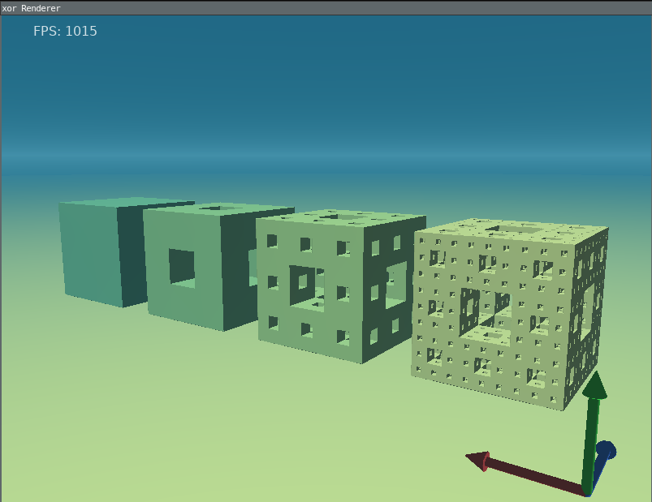

# xor_engine

A real-time ray marching engine built with Rust and CUDA that renders procedural geometry using signed distance functions (SDFs), constructive solid geometry (CSG), and space folding.

<p align="center">
  
</p>

## Overview

This engine demonstrates GPU-accelerated procedural rendering without traditional triangle meshes. Instead, scenes are defined purely by mathematical functions evaluated in real-time on the GPU. The implementation combines:

- **Rust** for safe, efficient host-side code
- **CUDA** for parallel ray marching on the GPU
- **ECS (Entity-Component-System)** for dynamic scene management
- **CUDA Graphs** for low-latency kernel execution

**Features:**
- Real-time sphere tracing through implicit surfaces
- CSG operations (union, intersection, difference) on binary trees
- Space folding for infinite geometry repetition
- Texture mapping (spherical and triplanar)
- Dynamic scene updates with dirty tracking
- Procedural sky and atmospheric fog

## Getting Started

### Prerequisites

- **CUDA Toolkit** (tested with CUDA 11+)
- **Rust** toolchain (stable)
- **SDL2** and **SDL2_ttf** libraries
- CUDA-capable GPU (compute capability 5.0+)

### Building

```bash
# Clone the repository
git clone https://github.com/EtiNL/xor_engine.git
cd xor_engine

# Compile CUDA kernels to PTX
nvcc -ptx src/gpu_utils/kernel.cu -o src/gpu_utils/kernel.ptx

# Build and run
cargo run --release
```

### Controls

- **Arrow Keys**: Rotate camera (yaw/pitch)
- **Space**: Move forward
- **Escape**: Exit

## Technical Deep-Dive

For an in-depth explanation of the techniques and implementation details, see the full article:

**[Rust + CUDA Ray-Marching Engine: Technical Overview](https://etinl.github.io/2025/06/12/Raymarching-Engine.html)**

The article covers:
- How signed distance functions work and why they're useful
- The sphere tracing algorithm and performance characteristics
- Binary CSG tree flattening for GPU evaluation
- Space folding mathematics and lattice transformations
- ECS-to-GPU synchronization architecture
- CUDA Graphs for predictable frame times

## Project Structure

```
xor_engine/
├── src/
│   ├── main.rs              # Entry point and main loop
│   ├── cuda_wrapper.rs      # CUDA driver API bindings
│   ├── display.rs           # SDL2 rendering and FPS counter
│   ├── scene.rs             # Scene builders (demos and utilities)
│   ├── ecs/
│   │   ├── mod.rs           # ECS core (World, Entity, SparseSet)
│   │   ├── components/      # Camera, Transform, SdfBase, Material, etc.
│   │   └── system/          # Input handling, physics stubs
│   └── gpu_utils/
│       └── kernel.cu        # CUDA kernels (ray gen, marching, shading)
├── assets/                  # Textures and resources
└── Cargo.toml
```

## Performance

Typical frame times on laptop RTX 3060 @ 800×600:
- **generate_rays**: ~0.1 ms
- **raymarch**: ~2-4 ms (scene dependent)
- **Total**: 220-400 FPS for typical scenes

Performance scales primarily with:
- Scene complexity (number of SDF primitives and CSG trees)
- Maximum ray march distance
- Screen resolution

## Examples

The repository includes several demo scenes:

### Basis Gizmo
Three-axis coordinate frame built from line and cone primitives, demonstrating basic SDF composition.

### CSG Demo
A sphere carved with three orthogonal rectangular slots, showcasing boolean operations (difference and union).

### Menger Sponge Showcase
Progressive fractal approximations (levels 0-3) demonstrating CSG tree construction and rendering limits.

## Limitations & Future Work

**Current limitations:**
- Single directional light
- No BVH acceleration structure
- Basic Lambertian shading only
- No real-time editor

**Planned improvements:**
- [ ] BVH over SDF primitives and CSG bounds
- [ ] Multiple lights and soft shadows
- [ ] PBR materials with environment maps
- [ ] Multi-GPU tiling
- [ ] Physics integration with SDF collision detection

## References

This project was inspired by the work of [Inigo Quilez](https://iquilezles.org/), whose research on distance functions and ray marching techniques has been instrumental in bringing procedural rendering to real-time graphics.

Key resources:
- [Distance Functions Library](https://iquilezles.org/articles/distfunctions/)
- [Sphere Tracing](https://iquilezles.org/articles/raymarchingdf/)
- [SDF Bounding Volumes](https://iquilezles.org/articles/sdfbounding/)

---

*Built with Rust 🦀 and CUDA ⚡*